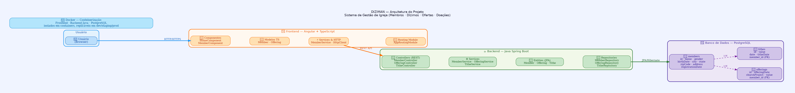

# Project DIZIMAN

## Descrição

DIZIMAN é uma aplicação web projetada para gerenciar membros, dízimos, ofertas e doações de uma igreja. Este documento detalha as ferramentas e tecnologias utilizadas no desenvolvimento do projeto, explicando a arquitetura e as vantagens de cada escolha tecnológica.

## Tecnologias Utilizadas

### 1. Java com Spring Boot

**Descrição**: Java é uma linguagem de programação robusta e orientada a objetos. Spring Boot é um framework que permite a criação de aplicações Spring prontas para produção de forma rápida e fácil.

**Vantagens**:
- **Produtividade**: A configuração automática e o vasto ecossistema de starters do Spring Boot permitem uma rápida configuração e desenvolvimento.
- **Gerenciamento de Dependências**: Spring Boot simplifica o gerenciamento de dependências e a configuração do servidor embarcado.
- **Segurança e Manutenção**: A comunidade extensa e o suporte contínuo melhoram a segurança e a manutenção do projeto.

### 2. Angular

**Descrição**: Angular é um framework de desenvolvimento para construir aplicações web dinâmicas usando TypeScript.

**Vantagens**:
- **MVVM (Model-View-ViewModel)**: Facilita a gestão de estados e a vinculação de dados, melhorando a eficiência do desenvolvimento.
- **Componentização**: Permite reutilizar código, facilitando a manutenção e teste de componentes individuais.
- **Extensibilidade**: Integrável com uma variedade de outras ferramentas e frameworks.

### 3. PostgreSQL

**Descrição**: PostgreSQL é um sistema de gerenciamento de banco de dados relacional objeto (SGBDRO) poderoso e de código aberto.

**Vantagens**:
- **Conformidade com ACID**: Garante confiabilidade nas transações.
- **Extensibilidade e SQL Compliance**: Suporta extensões e um grande conjunto de tipos de dados SQL, funções e operadores.
- **Desempenho**: Oferece performance robusta mesmo com grandes volumes de dados, graças ao seu sistema de otimização de consultas.

### 4. Docker

**Descrição**: Docker é uma plataforma de contêinerização que permite empacotar uma aplicação com todas as suas dependências em um contêiner virtual.

**Vantagens**:
- **Isolamento**: Garante que a aplicação funcione em qualquer ambiente.
- **Replicabilidade**: Facilita a replicação da aplicação em diferentes ambientes de desenvolvimento, teste ou produção.
- **Gerenciamento de Infraestrutura**: Simplifica o gerenciamento de infraestrutura e reduz conflitos entre equipes de desenvolvimento.

## Arquitetura do Projeto

O projeto DIZIMAN segue uma arquitetura baseada em microserviços, com cada serviço encapsulando uma lógica de negócios específica:
- **Backend**: Gerenciamento de dados e lógica de negócios implementados com Java e Spring Boot.
- **Frontend**: Interface do usuário implementada com Angular.
- **Database**: Persistência de dados gerenciada pelo PostgreSQL.

### Diagrama de Arquitetura

> 📌 Versão interativa no Miro: [Abrir diagrama](https://miro.com/app/board/uXjVHPaMUTo=/)

O diagrama ilustra o fluxo completo da aplicação:

**Usuário → Angular Frontend → Spring Boot Backend → PostgreSQL**

- O **Frontend Angular** consome a REST API do Spring Boot via `MemberService` e `HttpClient`.
- O **Backend Java** expõe endpoints REST através dos Controllers (`/api/members`, `/api/offerings`, `/api/tithes`), delega a lÃ